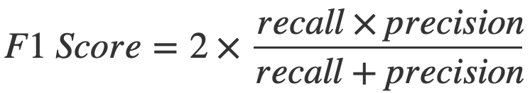

# Term Deposit Marketing - An Apziva Project (#2)
By Samuel Alter  
Apziva: G3SuQYZYrFt9dwF3

## Summary
This project used the following frameworks - Pandas, NumPy, Matplotlib, Seaborn, Optuna, and Scikit-learn - to analyze a phone call dataset from a bank and train models in an effort to help save the bank time. The dataset has within it demographic and banking data on their customers. By showing the model only certain columns, we can simulate the model learning which customers will most likely purchase a financial product of the bank.
* There are three phases to the project
  * Layer 1 involves simulating ignorance on which customer eventually was approved and bought the product
  * Layer 2 involves the full dataset to simulate which customers the bank should continue to call to secure the sale
  * Layer 3 involves unsupervised learning to figure out the groups of the customers

* Important conclusions:
  * Layer 1: A model achieved **over 403 hours of time savings**, or 14.25% of their total time. The model only missed 6% of their eventual subscribers.
  * Layer 2: I was able to train a model that **saved over 2,600 hours, or 93% of their total time**. The model only missed 11% of their total subscribers. 

## Overview
I produced two notebooks for this project, one for the [EDA](project2_eda.ipynb) and one for the [Modeling](project2_modeling.ipynb). This being the ReadMe, you can jump to those sections that are found below.
* [EDA](#eda)
* [Modeling](#modeling)

### Table of Contents
* [Summary](#summary)
* [Overview](#overview)
* [The dataset](#the-dataset)
* [Goals](#goals)
* [EDA](#eda)
  * [Figure 1]: Barplots of count of customers between successful and and failed campaigns(#figure-1)
  * [Figure 2]: Boxplots of numerical columns in dataset, separated by successful and failed campaigns(#figure-2)
  * [Figure 3]: Correlation of feature variables with target](#figure-3)
  * [What about Scatterplots?](#scat)
* [Modeling](#modeling)
  * [Notes on project setup](#notes-setup)
  * [Layer 1](#l1): Using only the demographic and banking data to simulate customers that haven't been contacted by the bank yet.
    * [Results] of Layer 1(#l1-results)
    * Other metrics to optimize: the [F1 Score](#f1)

### The dataset
[Back to TOC](#toc)
I am working with a phone call dataset that also has demographic information about the recipients:
| Column | Data Type | Comments |
|---|---|---|
| `age` | Numeric | The age of the customer |
| `job` | Categorical | The job category of the customer |
| `marital` | Categorical | Whether the customer is married |
| `education` | Categorical | The customer's level of education |
| `default` | Binary | If the customer has credit in default or not |
| `balance` | Numeric | Average yearly balance in Euros |
| `housing` | Binary | If the customer has a housing loan or not |
| `loan` | Binary | If the customer has a personal loan |
| `contact` | Categorical | The type of contact communication |
| `day` | Numeric | Last contact day of the month |
| `month` | Categorical | Last contact month of the year |
| `duration` | Numeric | Duration of the last phone call with the customer |
| `campaign` | Numeric | The number of contacts performed during this campaign and for this client including the last contact |
 
The final column, `y`, is the target of the dataset and shows whether the client subscribed to a term deposit.

### Goals 
[Back to TOC](#toc)
The startup is hoping that I can **achieve ≥81% accuracy** using a 5-fold cross validation strategy, taking the average performance score.

Bonus goals are:
* Determine which customers are most likely to buy the term deposit loan
  * Which segments of customers should the client prioritize?
* Determine what makes the customer buy the loan
  * Which feature should the startup focus on?

## EDA 
[Back to TOC](#toc)
There are 40000 rows and 14 columns in the datset, and it arrived to me clean, with no null values.

Of all 40000 customers, a little more than 7% received loans. This points to a very large class-imbalance in the datsaet.

With 13 columns, there was a lot of data to go through. We'll look at barplots of the amount of customers within each categorical column, separated into successful and failed campaigns [Figure 1](#figure-1), boxplots of the continuous columns [Figure 2](#figure-2), and a figure showing the correlatoin between each OneHotEncoded column against the target, `y` [Figure 3](#figure-3). Note: the columns were OneHotEncoded so that each column as shown in the figure refers to one category within a column. For example, there are four categories for highest level of education attained (primary, secondary, tertiary) and a category for customers with unknown education level. The OneHotEncoded version of this column would have a separate column for education_primary, with those that only possess that level of education getting encoded as a 1 and the rest getting a 0.

For the continuous columns, here's a statistical summary table:
|       | age          | balance      | day          | duration     | campaign     |
|-------|--------------|--------------|--------------|--------------|--------------|
| count | 40000.000000 | 40000.000000 | 40000.000000 | 40000.000000 | 40000.000000 |
| mean  | 40.544600    | 1274.277550  | 16.017225    | 254.824300   | 2.882175     |
| std   | 9.641776     | 2903.769716  | 8.278127     | 259.366498   | 3.239051     |
| min   | 19.000000    | -8019.000000 | 1.000000     | 0.000000     | 1.000000     |
| 25%   | 33.000000    | 54.000000    | 8.000000     | 100.000000   | 1.000000     |
| 50%   | 39.000000    | 407.000000   | 17.000000    | 175.000000   | 2.000000     |
| 75%   | 48.000000    | 1319.000000  | 21.000000    | 313.000000   | 3.000000     |
| max   | 95.000000    | 102127.000000| 31.000000    | 4918.000000  | 63.000000    |

We can glean the following insights from this table:
* The mean values for the `age`, `day`, and `campaign` columns are about equal to the 50th percentile
  * The distribution of the data may be symmetric
* The max value in each column besides `age` and `day` is much larger than the column's 75th percentile
  * This suggests there could be outliers
  * `age` and `day` are more or less categorical, so it makes sense that the max age is 95 and max day is 31

### Figure 1
[Back to TOC](#toc)

Although the raw numbers differ drastically between successful and failed campaigns, the patterns are similar for most of the features. Also notable is that there were no calls made to customers in the month of September.

### Figure 2
[Back to TOC](#toc)

Duration does indeed seem different, though recall that this feature is describing how long the last phone call was with the customer. It may not tell us that much.

### Figure 3
[Back to TOC](#toc)  

Duration has the highest correlation with the target variable at over 0.4.

### Scatterplots?
[Back to TOC](#toc)  
**What about scatterplots?** you may ask. **My response**: Scatterplots did not seem to give us much insight. The data are very dispersed and a pattern does not readily emerge:

## Modeling
[Back to TOC](#toc)  
For the modeling, I used random seed: 4769

_**`AutoSklearn` to  `Optuna` to `scikit-learn`: the Modeling Workflow**_

I first used [`AutoSklearn`](#https://automl.github.io/auto-sklearn/master/#) to help me explore the ML algorithm landscape to identify the best-performing models for this particular dataset.
Next, In order to find the best hyperparameters for our modeling, used [`Optuna`](#https://optuna.readthedocs.io/en/stable/index.html). This is similar to other hyperparameter search frameworks like [`Hyperopt`](#http://hyperopt.github.io/hyperopt/), which are designed to quickly and efficiently find the best hyperparameters for your dataset.
Finally, we will use `sklearn` to build the final, optimized model.

### Notes on project setup
[Back to TOC](#toc)  
We want to help the bank understand which customers are most likely to purchase the financial product. Knowing this would save the bank time and money. The dataset that we were given consists of demographic (and banking) data (like `age`,`job`,`marital`,and `balance`) as well as campaign-specific information (like `contact`,`day`,and `duration`).

| Demographic and Banking Data | Campaign-Specific Data | Target Feature |
|---|---|---|
| `age` | `contact` | `y` |
| `job` | `day` |  |
| `marital` | `month` |  |
| `education` | `duration` |  |
| `default` | `campaign` |  |
| `balance` |  |  |
| `housing` |  |  |
| `loan` |  |  |

We want to build a three-layered ML system that helps answer the project goals:
1. Understand which kinds of customers that they should call
 1. I will **not** give the model access to the campaign call data
1. After the initial calls, understand which customers the company should keep calling
 1. Give the model access to the campaign call data
1. Build a model using unsupervised learning to learn about clusters of customers in the dataset

[**Layer 1**](#l1):    
Use `X_1` to model which customers to make calls to. We are training a model that does not know any call data, so this is *before* making calls.

[**Layer 2**](#l2):  
Use the full `X` dataset (for clarity in its use in the layer flow, we'll be using `X_2` to model which customers the company should keep calling.

[**Layer 3**](#l3):  
Use unsupervised learning to uncover how the customers are grouped.

### Layer 1 
[Back to TOC](#toc)  
I wrote a function that utilized AutoSklearn to spend 60 minutes perfoming a fitting and evaluation of the models. The function then returned a list of models that achieved a high accuracy.

However, with our balanced dataset, we needed more control, as we had to tune for recall. I decided that the best course of action was to do the following: 
1. Run a [grid search](#https://scikit-learn.org/stable/modules/generated/sklearn.model_selection.GridSearchCV.html) of sorts. I created a list of scaling techniques, like [`StandardScaler`](#https://scikit-learn.org/1.5/modules/generated/sklearn.preprocessing.StandardScaler.html), a list of sampling techniques, like [`RandomOverSampler`](#https://imbalanced-learn.org/stable/references/generated/imblearn.over_sampling.RandomOverSampler.html) or [`SMOTETomek`](#https://imbalanced-learn.org/dev/references/generated/imblearn.combine.SMOTETomek.html), and a list of classifiers to test, like [`RandomForestClassifier`](#https://scikit-learn.org/stable/modules/generated/sklearn.ensemble.RandomForestClassifier.html) or [`LGBMClassifier`](#https://lightgbm.readthedocs.io/en/latest/pythonapi/lightgbm.LGBMClassifier.html).
2. Using nested `for` loops, I ran through each technique and saved the results to a dictionary.
3. I extracted the best metric from the results dictionary.
  * A best recall score of over 87% was found with using no scalers, the SMOTE resampling method, and the [SGDClassifier](#https://scikit-learn.org/stable/modules/generated/sklearn.linear_model.SGDClassifier.html) model:

| Class | Precision | Recall | F1-Score | Support |
|---|---|---|---|---|
| 0 | 0.95 | 0.19 | 0.31 | 7414 |
| 1 | 0.08 | 0.87 | 0.14 | 586 |
| Accuracy |  |  | 0.24 | 8000 |
| Macro Avg | 0.51 | 0.53 | 0.23 | 8000 |
| Weighted Avg | 0.89 | 0.24 | 0.30 | 8000 |

[Untuned, ideal model:](#untuned-ideal)  

(Jump to the [tuned model](#tuned-ideal) below)  

4. The results pointed me in the direction of which scaler, sampling technique, and model I should use to optimize with Optuna.
  * After 100 trials, I found these parameters, which gave a training recall score of almost 95%:

| Hyperparameter Name | Hyperparameter Value |
|---|---|
| penalty | elasticnet |
| l1_ratio | 0.9665372247163372 |
| loss | modified_huber |
| tol | 75.52719927740569 |
| learning_rate | invscaling |
| eta0 | 0.7274942852090539 |
| power_t | 647.2058587404654 |
| early_stopping | True |
| validation_fraction | 0.3765902841689254 |
| alpha | 7.181611953044439e-07 |
| fit_intercept | False |
| max_iter | 1344 |

5. Running a new model with these tuned hyperparameters gave the following results:

| Class | Precision | Recall | F1-Score | Support |
|---|---|---|---|---|
| 0 | 0.95 | 0.10 | 0.18 | 7414 |
| 1 | 0.08 | 0.94 | 0.14 | 586 |
| Accuracy |  |  | 0.16 | 8000 |
| Macro Avg | 0.51 | 0.52 | 0.16 | 8000 |
| Weighted Avg | 0.89 | 0.16 | 0.17 | 8000 |

[Tuned, ideal model](#tuned-ideal)

#### Interpreting the results 
[Back to TOC](#toc)
* When precision for class 0 is 95%, that means when the model predicts a customer as a non-subscriber, it is correct 95% of the time.
* A precision of 8% for class 1 indicates that the model is correctly predicting a customer as a subscriber 8% of the time. There are many false positives.
* The recall for class 0 is 10%, which means that the model is only identifying 10% of the non-subscribers correctly.
* A very high recall of 94% shows that the model identifies almost all of the actual subscribers correctly.
* **The take-home message: this model is really good at predicting subscribers.**

Now let's figure out how much time the company would save.
* The mean call time is about 4.25 minutes
* With 8000 customers in the test set, that is a total call time of 566.67 hours that the company needs to call all the customers
* TP + FP = Total calls with model
  * TP = 548
  * FP = 6703
  * Total calls with model = 7251
* Total calls with model * Mean call time = Total minutes with model
  * Total minutes with model minutes = 30,795
* Without the model, the company would have to call all 8000 customers:
  * 8000 * 4.25 = 33,976 minutes without model
* 33,976 call minutes without model - 30,795 call minutes with model = **3,181 minutes, or **53 hours**, or 9.36% of the total call time**.
While 52 hours is a fine result, it's not that meaningful of a savings. How did the [untuned model](#untuned-ideal), with ideal techniques perform? It saved the company 103 hours, so over 18%, but the company missed 74 subsribers rather than just 38.

#### Other metrics to optimize: F1 Score 
[Back to TOC](#toc)  
It was at this point that I thought about other metrics to optimize. Sure, we want to focus on the recall for class 1, because that captures the subscribers. But we also want to be mindful of saving the company time overall as well. The F1 Score could be helpful here, as it is a metric that is the harmonic mean of the recall and precision. Would this be the best balancing of the tradeoff between precision and recall? The F1 Score may also be better at accomodating the class distribution.

Remember that TP = True positive, FP = False positive, TN = True negative, and FN = False negative.

Using the same nested for loops as before, this time I extracted the best F1 Score result, and found that a MinMaxScaler with a SMOTE resampling technique on the LGBMClassifier was the best, and I got the following result:

| Class | Precision | Recall | F1-Score | Support |
|---|---|---|---|---|
| 0 | 0.94 | 0.57 | 0.71 | 7414 |
| 1 | 0.09 | 0.56 | 0.16 | 586 |
| Accuracy |  |  | 0.57 | 8000 |
| Macro Avg | 0.52 | 0.57 | 0.43 | 8000 |
| Weighted Avg | 0.88 | 0.57 | 0.67 | 8000 |

This model saved the company almost 316 hours, or 55.8% of their time, but it missed about half of their true customers. A threshold value of 0.005 produced the best recall score of this entire project (96%), and only missing 25 customers. This model, however, would only save the company just under 40 hours, or almost 7% of their total time.

What about utilizing a threshold value to tune the probability decision line for probabilities? If we can choose a better threshold, we may be able to control the cutoff point and settle with a tradeoff that we're comfortable with.

To illustrate this relationship, I generated a list of threshold values and saved the result. I tracked the recall score for both class 0 and 1 as well as the true and false positive amount for class 1. The vertical line is at a threshold value that would produce a 90% recall score for class 1:

Running the model on the testing set with the threshold value to yield a 90% recall score for class 1 saves the company just over 74 hours, or almost 13.1% of their time. They only miss 56 subscribers.

### Layer 2 
[Back to TOC](#toc)

Now it comes to the last step: running the model on the full dataset. I have gone through several models, tuned to a couple metrics, and iterated to find an optimal threshold value. This last step is crucial because it will show the company what time they can save overall. We will now run a new model first by training it on a train set that has been resampled, then testing it on the full dataset that has been encoded and scaled but not resampled.

When running the following specifications on the full dataset, we were able to get incredible time savings of almost 2,634 hours (or 109 days, 18 hours), which equates to more than 93% time savings had the company called every single individual in their dataset.

Specifications:
* OneHotEncode
* StandardScaler
* RandomOverSampler
* RandomForestClassifier
* 5-fold StratifiedKFold

| Class | Precision | Recall | F1-Score | Support |
|---|---|---|---|---|
| 0 | 0.99 | 0.99 | 0.99 | 37104 |
| 1 | 0.92 | 0.89 | 0.90 | 2896 |
| Accuracy |  |  | 0.99 | 8000 |
| Macro Avg | 0.96 | 0.94 | 0.95 | 40000 |
| Weighted Avg | 0.99 | 0.99 | 0.99 | 40000 |

_**This model will save the company almost 2,634 hours, or over 93% of their time, while letting only 11% of their customers through.**_

### Layer 3 
[Back to TOC](#toc)

Under construction...
